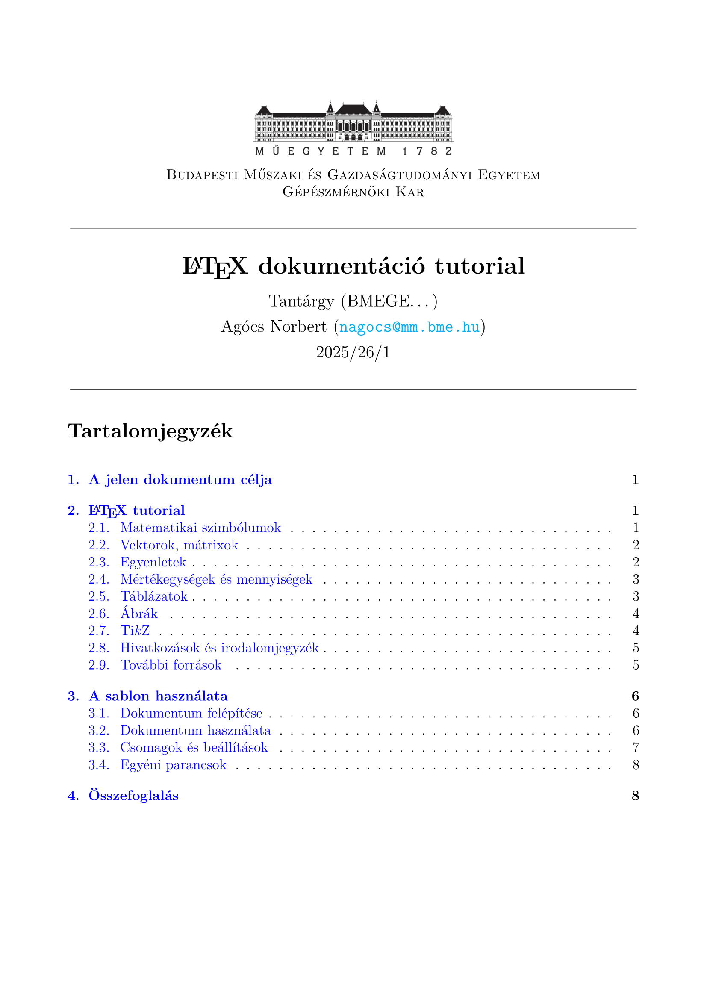

# Awesome $\LaTeX$ Homework

Ez a repó egy egyszerűen használható dokumentum sablont tartalmaz, amely segítségével eékészítheted házi feladataidat $\LaTeX$-ben.  _A cél az, hogy ne a formázással kelljen bajlódnod, hanem a tartalomra koncentrálhass._

Ha még csak most ismerkedsz a $\LaTeX$-kel, ez a sablon egy jó kiindulópont: segít átlátni a legfontosabb parancsokat és megmutatja, hogyan lehet professzionális kinézetű dokumentumot készíteni néhány egyszerű lépéssel.

---

## Miért a $\LaTeX$?

A $\LaTeX{}$ egy nyílt forráskódú, platformfüggetlen szövegszerkesztő rendszer, amelyet kifejezetten tudományos és műszaki dokumentumokhoz fejlesztettek ki. A $\LaTeX$ szövegszerkesztés fő előnyei:
- **Tipográfiai minőség** – professzionális megjelenés, különösen matematikai és tudományos szövegek esetén.  
- **Összetett dokumentumok** – táblázatok, ábrák, képletek és irodalomjegyzékek könnyen kezelhetők.  
- **Ingyenes és hordozható** – minden nagyobb operációs rendszeren elérhető, licencdíj nélkül.  
- **Kollaboráció** – jól használható verziókezelő rendszerekkel, így egyszerű a közös munka.  
- **Szakmai elvárás** – számos konferencia és folyóirat $\LaTeX{}$ formátumban kéri a kéziratokat, ezért ismerete nagy előnyt jelent.


```
 „LATEX is not about making things look pretty. 
 It’s about making things look right.”
```

---

## Hogyan kell telepíteni a $\LaTeX$-et?

A legegyszerűbb módja a $\LaTeX$ kipróbálásának az [Overleaf](https://overleaf.com) használata, amely egy online szövegszerkesztő és fordító környezet. Nem igényel telepítést, böngészőből működik.

Ha azonban offline környezetben (például Visual Studio Code-ban) szeretnéd használni a sablont, kövesd az alábbi lépéseket. A telepítés menetét részletesen bemutatja ez a [YouTube videó](https://www.youtube.com/watch?v=4lyHIQl4VM8), amely segítséget nyújthat az egyes lépések követésében.

### 1. $\TeX$ disztribúció telepítése
Látogass el a [miktex.org/download](https://miktex.org/download) oldalra, és töltsd le a rendszerednek megfelelő telepítőt (Windows / macOS). A telepítés során javasolt bekapcsolni az **automatikus csomagfrissítést**, hogy a rendszer mindig naprakész maradjon.  

### 2. Strawberry Perl telepítése
Bizonyos kiegészítők és szkriptek futtatásához szükség lehet Perl környezetre. Ehhez telepítsd a [Strawberry Perl](https://strawberryperl.com/) legfrissebb verzióját a használt operációs rendszeredhez.  

### 3. Visual Studio Code beállítása
Töltsd le és telepítsd a [Visual Studio Code](https://code.visualstudio.com/) programot. A bővítmények között keresd meg és telepítsd a **LaTeX Workshop** kiegészítőt. Nyisd meg a sablon mappáját VS Code-ban, majd szerkeszd a `main.tex` fájlt. A fordításhoz használd a **LaTeX Workshop** beépített parancsait (pl. *Build LaTeX project*).  

---

## Dokumentum sablon használata

### Felépítés
A dokumentum sablon az alábbi fájlokból és mappákból áll:

- **`main.tex`** – a dokumentum fő fájlja.
- **`settings/00_preambulum.tex`** – a dokumentum általános beállításai.  _(Nem szükséges szerkeszteni.)_
- **`settings/01_commands.tex`** – egyéni parancsok gyűjteménye.
- **`contents/01_title.tex`** – a címlap. _(Nem szükséges szerkeszteni.)_
- **`contents/02_contentpage.tex`** – a tartalomjegyzék.  _(Nem szükséges szerkeszteni.)_
- **`contents/03_bib.tex`** – az irodalomjegyzék.  _(Nem szükséges szerkeszteni.)_
- **`contents/literature.bib`** – a hivatkozások tárolása BibTeX formátumban.
- **`figures/`** – ide kerülnek az ábrák és képek, amelyeket a dokumentumba szeretnél beilleszteni.

A szövegszerkesztés során alapvetően a `main.tex` fájlban szükséges dolgozni.

### Könyvtárstruktúra
```bash
.
├── main.tex # fő fájl (ezt kell szerkeszteni)
├── settings/
│ ├── 00_preambulum.tex # csomagok és beállítások
│ └── 01_commands.tex # egyéni parancsok
├── contents/
│ ├── 01_title.tex # címlap
│ ├── 02_contentpage.tex # tartalomjegyzék
│ ├── 03_bib.tex # irodalomjegyzék
│ └── literature.bib # hivatkozások
└── figures/ # ábrák, képek
```

### Használat

A dokumentum sablon használata a következő lépésekből áll:

1. **Repo klónozása vagy letöltése**  
   Másold le a sablont a saját gépedre Git segítségével, vagy töltsd le a ZIP-fájlt a GitHub felületről.

2. **A `main.tex` fájl szerkesztése**  
   Nyisd meg a `main.tex` fájlt, töltsd ki a dokumentum alapadatait (cím, szerző, Neptun-kód, tárgy, dátum), majd írd meg a tartalmat a megfelelő fejezetekben.

3. **Fordítás**  
   Fordítsd le a dokumentumot a választott környezetben (pl. Visual Studio Code + LaTeX Workshop, Overleaf, vagy parancssorból `pdflatex/latexmk`).  
   A fordítás után a kész PDF automatikusan létrejön.

4. **Ábrák és hivatkozások**  
   - Az ábrákat a `figures/` mappába helyezd, és az `\includegraphics{}` paranccsal hivatkozz rájuk.  
   - A hivatkozásokat a `contents/literature.bib` fájlban add meg BibTeX formátumban, majd a szövegben a `\cite{}` paranccsal idézd őket.  

5. **Kiegészítő anyagok (opcionális)**  
   Ha mellékleteket, programkódokat vagy jegyzőkönyveket is csatolni szeretnél, azokat PDF formátumban a `\includepdf{}` paranccsal illesztheted be a dokumentum végére.


## Példa
Lásd a generált [`tutorial.pdf`](./tutorial.pdf) és [`tutorial.tex`](./tutorial.tex) fájlt a sablon használatának bemutatásához.

[](tutorial.pdf)

## Licenc
Ez a projekt az MIT License alatt érhető el.  
Ez azt jelenti, hogy a kód szabadon felhasználható, módosítható és terjeszthető, akár kereskedelmi célokra is, 
feltéve, hogy a szerzői jogi megjegyzés és a licenc szövege minden másolatban szerepel.  

MIT License © 2025 Agócs Norbert


